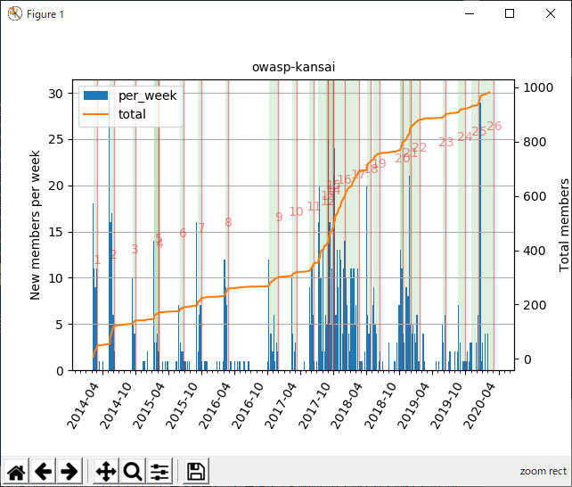

# dk-community_data_visualization
Let's visualize your Doorkeeper community data.

# はじめに
IT勉強会、イベントの運営プラットフォームのひとつDoorkeeper https://www.doorkeeper.jp/  
自分が主催するコミュニティにおいて、人数推移などコミュニティ運営に役立つデータを可視化します  
DoorkeeperにもAPIが用意されていますが、コミュニティ運営に役立つ機能としては十分ではありません  
Webスクレイピングを利用してデータを取得し、整理します

# インストール
python3を利用します。  
```
pip install requests
pip install beautifulsoup4
pip install numpy
pip install matplotlib
```
手元のバージョン情報はこちら  
```
>python --version
Python 3.8.1

>pip freeze
beautifulsoup4==4.8.2
matplotlib==3.1.3
numpy==1.18.1
requests==2.22.0
```

# 実行
任意のフォルダ上でpythonスクリプトを実行します  
以下の可能です  
* dk_login()  
    * Doorkeeperへのログイン、Cookie取得、主催コミュニティが複数存在する場合は分析対象の選択  

* get_event_list(cookies, group_url)  
    * Webスクレイピングで主催コミュニティのイベント情報をリストで取得  
    * イベント情報のkeyは`'num', 'url', 'id', 'title', 'attendance', 'capacity', 'date', 'publish'`  
    * `event_list.txt`の出力  
    
* get_member_list(cookies, group_url)  
    * Webスクレイピングで主催コミュニティに参加するメンバー情報をリストで取得  
    * メンバー情報のkeyは`'num', 'name', 'url', 'date', 'attend', 'attend_count'`  
    * `member_list.txt`の出力  
    
* check_atend_ranking(member_list)  
    * 全参加者の中で、Top10を出力する  
    
* plot_member_transition(event_list, member_list)  
    * コミュニティ参加者の人数推移をグラフ化（横軸：日時、縦軸：人数（新規加入者/週、総和））  
    
    
# 参考URL
https://matplotlib.org/gallery/index.html

